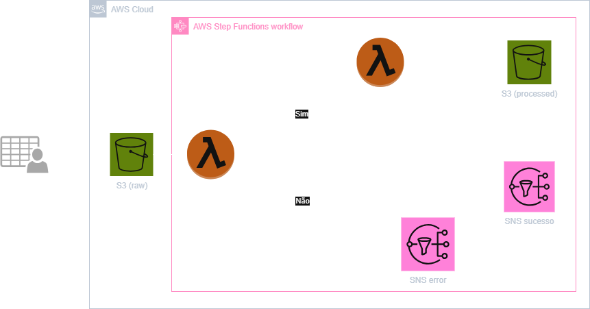
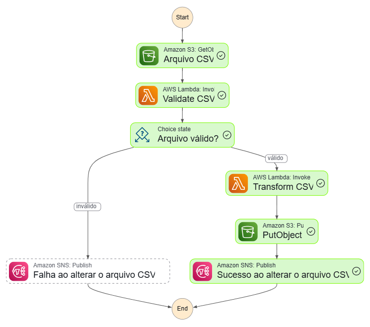
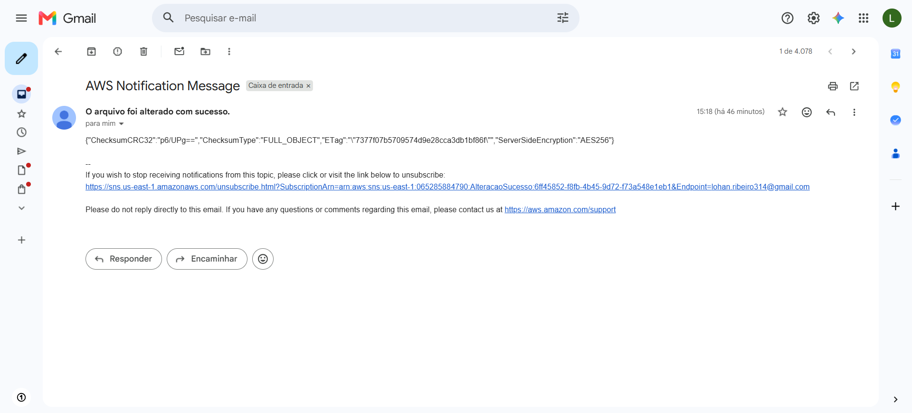

# Explorando AWS Step Functions na Construção de um Pipeline ETL Serverless
Este projeto tem como objetivo explorar o AWS Step Functions, serviço de orquestração de workflows da AWS, por meio da construção de um pipeline ETL serverless para processamento de arquivos CSV armazenados no Amazon S3.

A solução integra serviços da AWS para validar, transformar e armazenar dados de forma automatizada, utilizando uma arquitetura orientada a eventos, escalável e de baixo acoplamento.
<br></br>

## 🎯 Objetivo

Desenvolver um pipeline ETL serverless utilizando AWS Step Functions para orquestrar etapas de validação, transformação e armazenamento de dados.
<br></br>

## 🏗️  Arquitetura



<p align="center">
  <em>Arquitetura desenvolvida utilizando Draw.io.</em>
</p>

### Fluxo:

1. Leitura do arquivo CSV armazenado no Amazon S3.
2. Validação da estrutura e integridade do arquivo.
3. Decisão de fluxo utilizando Choice State.
4. Transformação dos dados com AWS Lambda.
5. Armazenamento do arquivo processado na camada processed.
6. Envio de notificação por e-mail utilizando Amazon SNS.



### Exemplo de Notificação


<br></br>

## 🚀 Tecnologias

- AWS Lambda
- Amazon S3
- AWS Step Functions
- Amazon SNS
- Python
- JSONata
<br></br>

## ⚙️ Funcionalidades
- Processamento de arquivos CSV utilizando Amazon S3.
- Validação automática de arquivos CSV.
- Verificação de colunas obrigatórias.
- Verificação de registros válidos.
- Transformação de dados utilizando Python.
- Armazenamento automatizado dos arquivos processados.
- Notificações automáticas por e-mail.
- Orquestração serverless com AWS Step Functions.
<br></br>

## 📚 Estrutura do Projeto

```
aws-step-functions-etl/  
├── architecture/        arquitetura do workflow
├── data/                arquivos csv
├── docs/                capturas do processo
├── lambdas/             funções lambdas
└── README.md  
```

## 🎓 Aprendizados

Durante o desenvolvimento deste projeto foram aplicados conceitos de:

- Computação em nuvem (AWS)
- Arquitetura serverless
- Orquestração de workflows
- Processamento de dados com Python
- Integração entre serviços AWS
- Tratamento e validação de arquivos CSV
- AWS IAM e gerenciamento de permissões
- Expressões JSONata em AWS Step Functions
- Mensageria e notificações com SNS
<br></br>

## ✅ Resultado

O pipeline foi capaz de:

- Validar arquivos CSV armazenados no Amazon S3.
- Transformar os dados utilizando AWS Lambda.
- Armazenar automaticamente os dados processados.
- Enviar notificações por e-mail utilizando Amazon SNS.
- Orquestrar todo o fluxo utilizando AWS Step Functions.
<br></br>

## ⚠️ Aviso
Todos os dados usados ​​neste projeto são fictícios e usados ​​apenas para fins educacionais.
